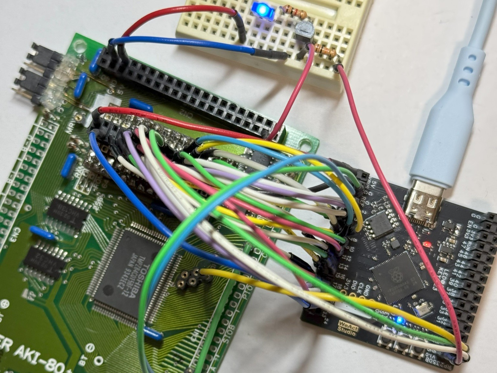
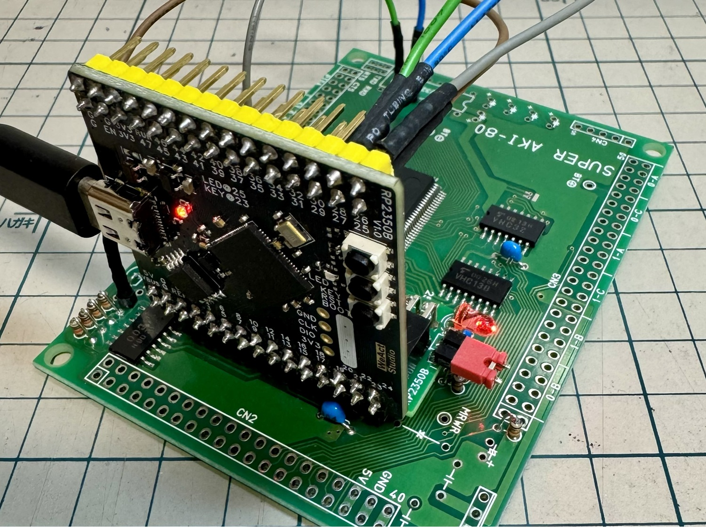
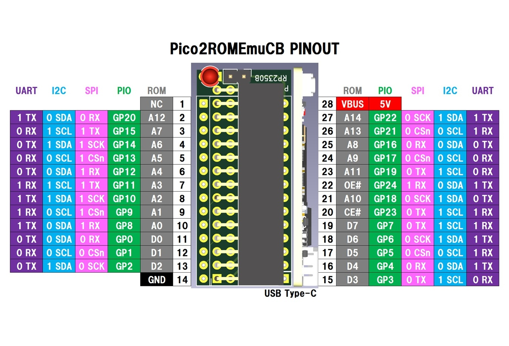
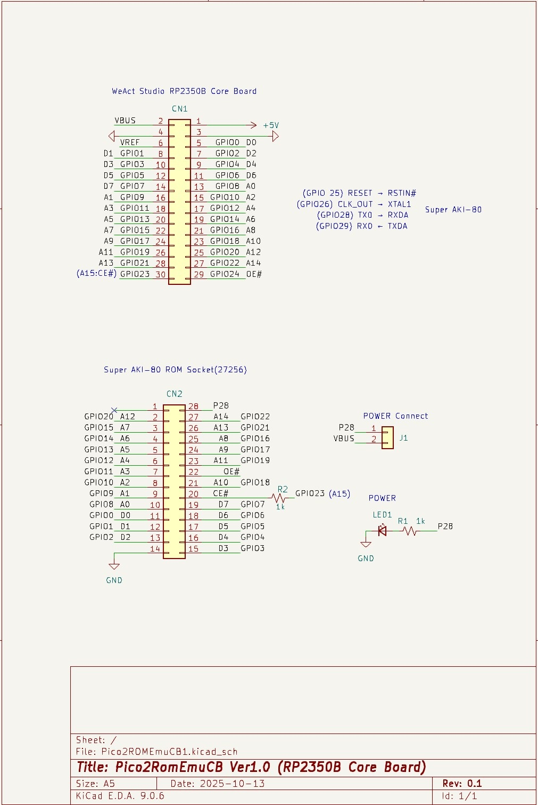
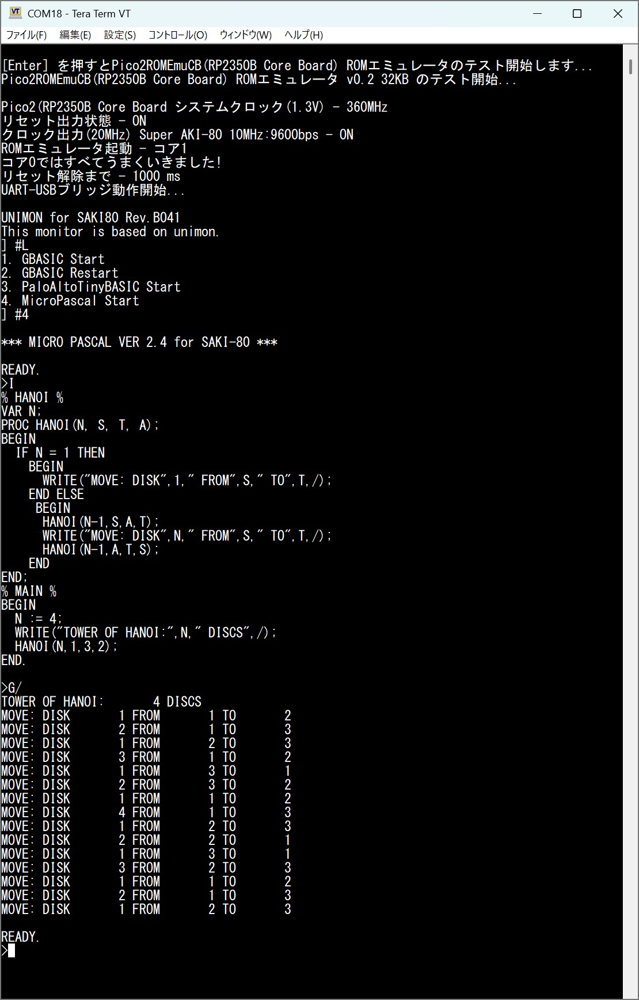
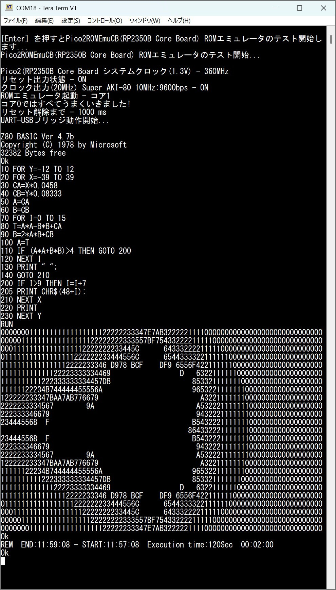

# Pico2ROMEmu - RP2350B Core Board Version
<!--  -->

このプロジェクトは Pico2ROMEmuに RP2350B Core Boardを使用した簡単で高速なROMエミュレータです  
[English Readme](./README.en.md)

## 特徴
- 詳しくは[Pico2ROMEmu](https://github.com/kyo-ta04/Pico2ROMEmuBR)をご覧ください。

## 構成
- KiCad 回路図、PCB、ガーバーファイルはこちら→ [./PCB/](./PCB/) (**2025/11/09 追加 V1.0 R0.1**)
  - KiCad Ver9.0.6、 JLCPCB Fabrication Toolkit Plugin 使用
- `saki80mon041_const.c` などの ROMデータ部分は [https://github.com/yyhayami/saki80mon041](https://github.com/yyhayami/saki80mon041) 由来です。  
UNIMON for SAKI80は、asano氏が公開されているUniversal MonitorをベースにAki.H氏による大幅な拡張がなされてEMUZ80用に公開されているEMUZ80_Monitor Rev.B04を @yyhayami氏が Super AKI-80 で動作するよう移植したものです。
- `rom_basic_const.c` などの ROM-BASIC 部分は [saki80basic](https://github.com/vintagechips/saki80basic) 由来です。
  - 元の[BASICサブセット](http://searle.x10host.com/cpm/index.html)は Grant Searle さんが作成したものであり、[Super AKI-80用に @vintagechip（電脳伝説）](https://vintagechips.wordpress.com/2025/04/24/saki80basic/)さんが移植・改良されています。
- [Tom's SBC](https://oshwlab.com/peabody1929/CPM_Z80_Board_REV_B_copy-76313012f79945d3b8b9d3047368abf7)はpeabody1929さんが作成したものであり、ROMデータは[CP/M machine - Grant Searle](http://searle.x10host.com/cpm/index.html) 由来です。
- [68k-nano](https://github.com/74hc595/68k-nano)は Matt Sarnoff(74hc595)さんが作成、公開されています。 ROMデータはソースから生成しました。
- RP2350 PIO ROMエミュレーション部分は @tendai22plus さんの [ROMエミュレーション](https://github.com/tendai22/emuz80_pico2/blob/main/doc/ROM_EMULATION.md) を参考にさせていただいてます。　参考: [emuz80_pico2](https://github.com/tendai22/emuz80_pico2) 
- 使用している WeAct StudioのRP2350B Core Boardは、Raspberry Pi RP2350Bマイクロコントローラを搭載したコンパクトな開発ボードで、サイズわずか41.4×41.1mmながら全48本のI/Oピンを2つの30ピンヘッダー引き出しています。  
Github : [WeActStudio.RP2350BCoreBoard](https://github.com/WeActStudio/WeActStudio.RP2350BCoreBoard)

## 回路図・資料
- 
上記はピン配置の画像です。
- 
上記は回路図の画像です。
- 
上記は saki80mon041.hex使用時の実行例画像です。
- 
上記は SAKI80MB.HEX使用時の実行例画像です。

## ライセンス
- 本プロジェクトのソースコードは MIT ライセンスです。
- ROMデータ部分などは元サイトおよび改編元のライセンスを参照してください。

## 免責事項
本ソフトウェアは現状のまま提供されます。いかなる損害についても作者は責任を負いません。

## 謝辞
- Grant Searle さん（[BASICサブセット版/CP/M machine 作者）](http://searle.x10host.com/index.html)）
- @vintagechip さん（[電脳伝説さん Super AKI-80用BASIC 作者](https://vintagechips.wordpress.com/)）
- @tendai22plus さん ([emuz80_pico2  作者](https://github.com/tendai22/emuz80_pico2))
- peabody1929 さん ([Tom's SBC 作者](https://oshwlab.com/peabody1929/works))
- Matt Sarnoff(74hc595)さん ([68k-nano 作者](https://github.com/74hc595/68k-nano))
- @yyhayamiさん（[saki80mon041 作者）](https://github.com/yyhayami/saki80mon041)）
- @electrelic(asano)さん（[Universal Monitor 作者）](https://electrelic.com/electrelic/node/1317)）
- @akih_san(Aki.h) さん（[EMUZ80-MON 作者](https://github.com/akih-san/EMUZ80-MON)）
- @shippoiincho さん、 @kondo_pc88 さん、 @TororoLab さん、 @I_HaL さん、 @antarcticlion さん、 @GAPUX さん、 @Tanuki_Bayashin さん、 @applesorce さん、@W88DodPECuThLOl さんを始めとしたアドバイス、イイね、RPしていただいた皆様。
- Raspberry Pi Pico SDK 開発者の皆様
- 本プロジェクトに関わる全ての方々
- [Pico2ROMEmu](https://github.com/kyo-ta04/Pico2ROMEmuBR)もご覧ください。

