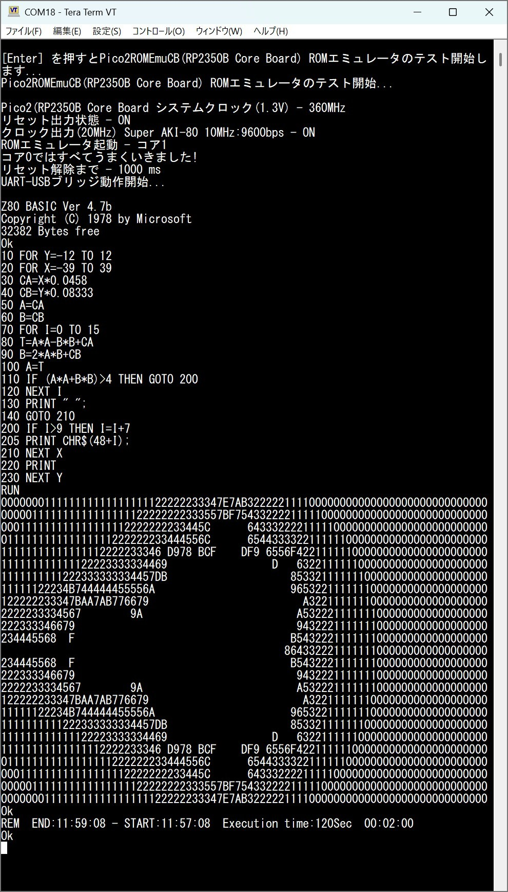

# Pico2ROMEmu - RP2350B Core Board Version
<!--  -->

このプロジェクトは Pico2ROMEmuに RP2350B Core Boardを使用した簡単で高速なROMエミュレータです  
[English Readme](./README.en.md)

## 特徴
- 詳しくは[Pico2ROMEmu](https://github.com/kyo-ta04/Pico2ROMEmuBR)をご覧ください。

## 構成
- `saki80mon041_const.c` などの ROMデータ部分は [saki80mon041.hex](https://github.com/yyhayami/saki80mon041) 由来です。  
UNIMON for SAKI80は、asano氏が公開されているUniversal MonitorをベースにAki.H氏による大幅な拡張がなされてEMUZ80用に公開されているEMUZ80_Monitor Rev.B04を @yyhayami氏が Super AKI-80 で動作するよう移植したものです。
- 使用している WeAct StudioのRP2350B Core Boardは、Raspberry Pi RP2350Bマイクロコントローラを搭載したコンパクトな開発ボードで、サイズわずか41.4×41.1mmながら全48本のI/Oピンを2つの30ピンヘッダー引き出しています。  
Github : [WeActStudio.RP2350BCoreBoard](https://github.com/WeActStudio/WeActStudio.RP2350BCoreBoard)

## 回路図・資料
- 
上記は回路図の画像です。
- 
上記は saki80mon041.hex使用時の実行例画像です。
- 
上記は SAKI80MB.HEX使用時の実行例画像です。

## ライセンス
- 本プロジェクトのソースコードは MIT ライセンスです。
- ROMデータ部分は元サイトおよび改編元のライセンスを参照してください。

## 免責事項
本ソフトウェアは現状のまま提供されます。いかなる損害についても作者は責任を負いません。

## 謝辞
- @yyhayamiさん（[saki80mon041 作者）](https://github.com/yyhayami/saki80mon041)）
- @electrelic(asano)さん（[Universal Monitor 作者）](https://electrelic.com/electrelic/node/1317)）
- @akih_san(Aki.h) さん（[EMUZ80-MON 作者](https://github.com/akih-san/EMUZ80-MON)）
- x.comなどでアドバイス、イイね、RPしていただいた皆様。
- Raspberry Pi Pico SDK 開発者の皆様
- 本プロジェクトに関わる全ての方々
- [Pico2ROMEmu](https://github.com/kyo-ta04/Pico2ROMEmuBR)もご覧ください。

---

MIT License

Copyright (c) 2025 kyo-ta04(DragonballEZ)

Permission is hereby granted, free of charge, to any person obtaining a copy
of this software and associated documentation files (the "Software"), to deal
in the Software without restriction, including without limitation the rights
to use, copy, modify, merge, publish, distribute, sublicense, and/or sell
copies of the Software, and to permit persons to whom the Software is
furnished to do so, subject to the following conditions:

The above copyright notice and this permission notice shall be included in all
copies or substantial portions of the Software.

THE SOFTWARE IS PROVIDED "AS IS", WITHOUT WARRANTY OF ANY KIND, EXPRESS OR
IMPLIED, INCLUDING BUT NOT LIMITED TO THE WARRANTIES OF MERCHANTABILITY,
FITNESS FOR A PARTICULAR PURPOSE AND NONINFRINGEMENT. IN NO EVENT SHALL THE
AUTHORS OR COPYRIGHT HOLDERS BE LIABLE FOR ANY CLAIM, DAMAGES OR OTHER
LIABILITY, WHETHER IN AN ACTION OF CONTRACT, TORT OR OTHERWISE, ARISING FROM,
OUT OF OR IN CONNECTION WITH THE SOFTWARE OR THE USE OR OTHER DEALINGS IN THE
SOFTWARE.
